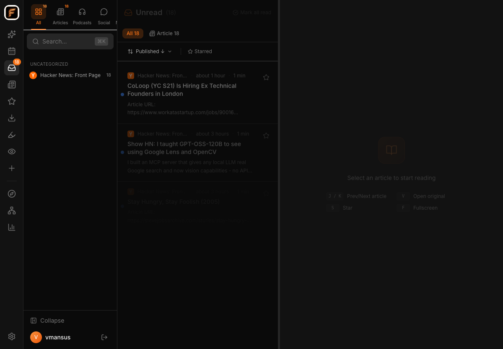
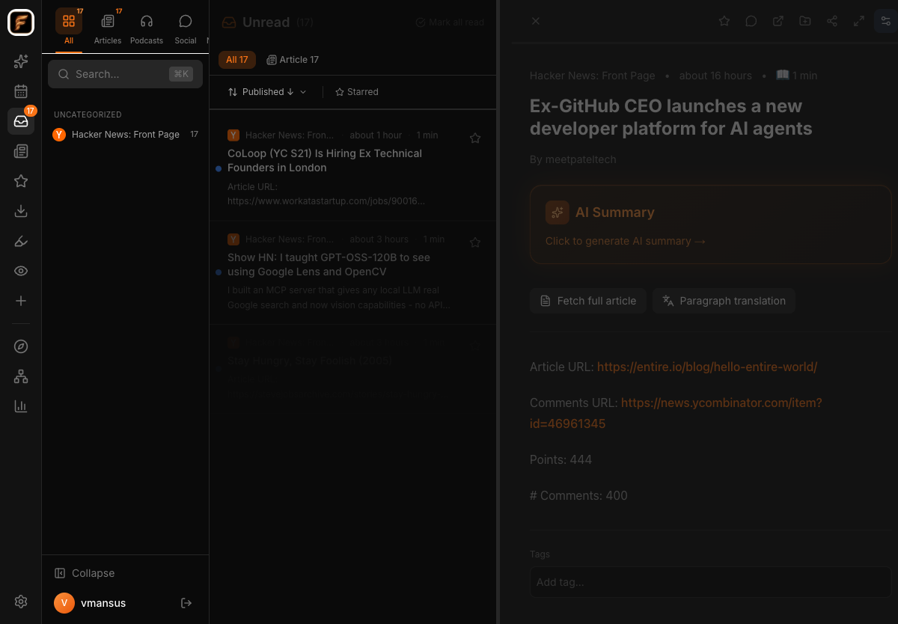
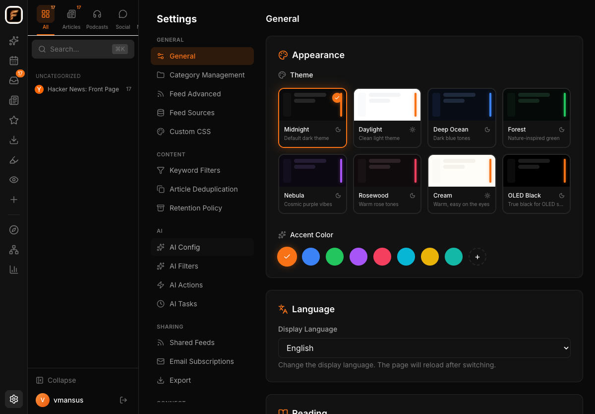

<p align="center">
  
</p>

<h1 align="center">FeedGlow</h1>

<p align="center">
  <strong>A modern, self-hosted RSS reader with AI superpowers</strong>
</p>

<p align="center">
  
</p>

<p align="center">
  
  
</p>

---

## Features

- 📰 **RSS Reading** — Subscribe, organize, read. Multiple views, keyboard shortcuts, reading themes.
- 🤖 **AI Integration** — Summarize, translate, filter articles. Supports OpenAI, Anthropic, Ollama.
- 📝 **Highlights & Notes** — Select text, highlight in 4 colors, add inline notes. Powered by CSS Custom Highlights API.
- 🔍 **Feed Discovery** — Browse RSSHub catalog, search Google News, auto-discover RSS from URLs.
- 📬 **Multi-Source** — RSS, newsletters (via email), web page monitoring, podcasts.
- 🌐 **i18n** — Chinese & English UI with locale-aware formatting.
- 🎨 **Themeable** — Dark/light mode, 5 color schemes, adjustable typography, custom CSS injection.
- 📱 **PWA** — Installable as a desktop or mobile app with offline support.
- 🔒 **Self-Hosted** — Your data, your server. No tracking, no telemetry.
- 📊 **Reading Progress** — Scroll-based tracking with progress bars synced across devices.
- 🔗 **Shared Feeds** — Curate and publish collections as public JSON feeds.
- 👀 **Web Monitoring** — Watch pages for changes with configurable intervals and diff view.
- 🐦 **Twitter Integration** — Save tweets via Clipper extension with full-text extraction.

## Tech Stack

| Layer | Technology |
|-------|-----------|
| Frontend | Next.js 14, React, Tailwind CSS, Framer Motion |
| Backend | Hono, TypeScript, Zod |
| Database | PostgreSQL |
| AI | Vercel AI SDK (OpenAI / Anthropic / Ollama) |

## Quick Start

### Local Development

```bash
git clone https://github.com/vmansus/feedglow.git
cd feedglow
pnpm install
```

Edit the configuration at the top of `dev.sh`, then:

```bash
./dev.sh
```

This will automatically:
- Start PostgreSQL (Homebrew)
- Create the database if needed
- Build and start the API server (port 3001)
- Start the Next.js dev server (port 3000)

Press `Ctrl+C` to stop everything.

> **Prerequisites:** Node.js 18+, pnpm, PostgreSQL 17 (`brew install postgresql@17`)

### Docker

```bash
cd docker
cp .env.example .env   # edit with your passwords
docker compose up -d
```

Three containers will start:
- **postgres** — PostgreSQL 17 (port 5432)
- **feedglow** — API server (port 3001)
- **web** — Next.js frontend (port 3000)

Visit `http://localhost:3000` to get started.

## Project Structure

```
feedglow/
├── apps/
│   ├── api/        # Hono API server
│   └── web/        # Next.js frontend
├── packages/
│   ├── shared/     # Shared types & schemas
│   └── ui/         # UI utilities
├── docker/         # Docker Compose & Dockerfile
├── dev.sh          # One-click local dev startup
└── .env.example
```

## Environment Variables

| Variable | Default | Description |
|----------|---------|-------------|
| `DATABASE_URL` | `postgres://localhost:5432/feedglow` | PostgreSQL connection string |
| `JWT_SECRET` | — | Secret key for JWT tokens |
| `PORT` | `3001` | API server port |
| `REGISTRATION_MODE` | `closed` | `open`, `closed`, or `invite` |
| `NEXT_PUBLIC_API_URL` | `http://localhost:3001` | API URL for the frontend |
| `OPENAI_API_KEY` | — | OpenAI API key (optional) |
| `ANTHROPIC_API_KEY` | — | Anthropic API key (optional) |

## Related Projects

| Project | Description |
|---------|-------------|
| [feedglow-clipper](https://github.com/vmansus/feedglow-clipper) | Browser extension for saving articles & tweets |
| [feedglow-ios](https://github.com/vmansus/feedglow-ios) | iOS app |

## Contributing

See [CONTRIBUTING.md](./CONTRIBUTING.md).

## License

[MIT](./LICENSE)
